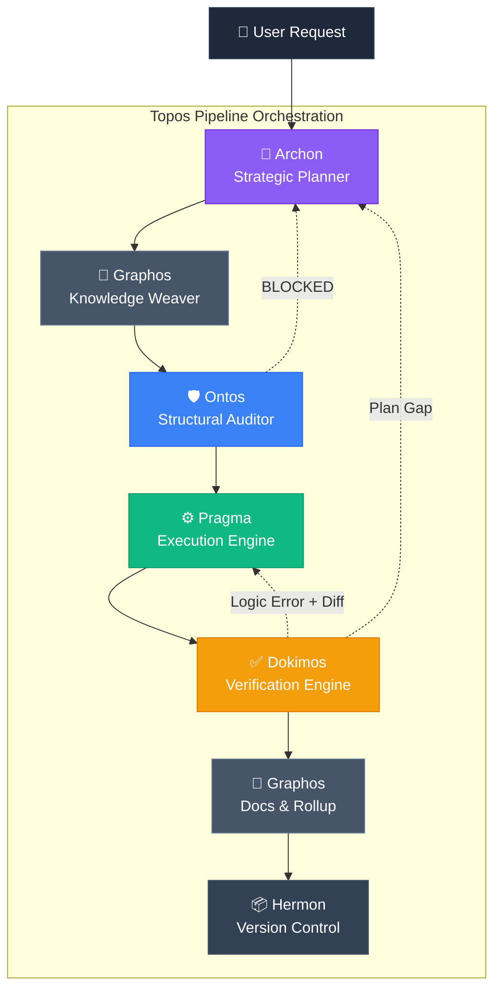
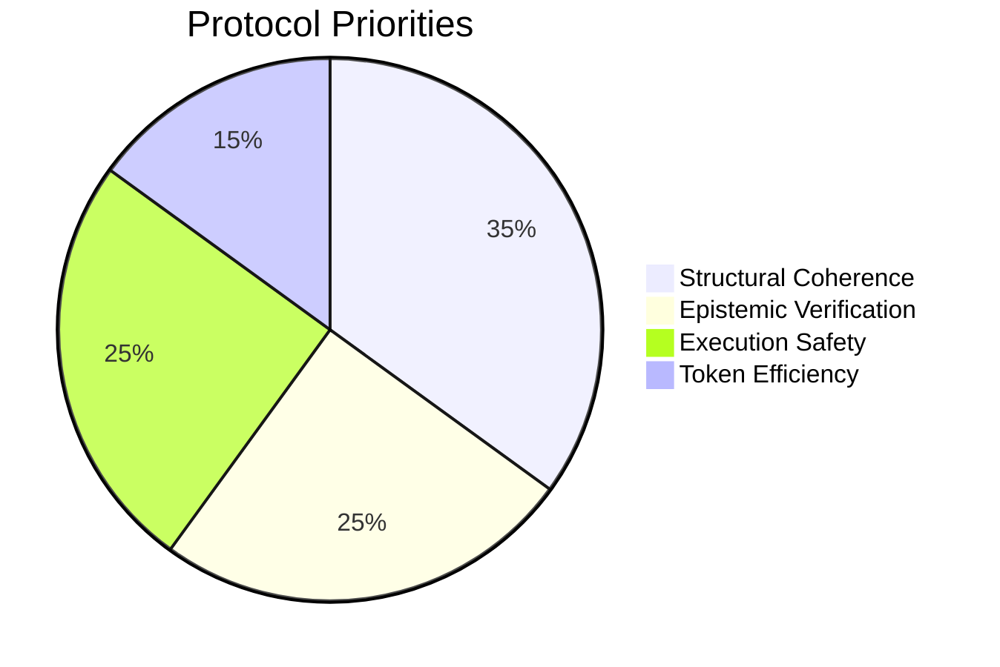

<div align="center">

# Topos Pipeline Agentic Framework

**A multi-agent reference architecture enforcing the Topos Integrity Protocol.**

[](#)
[](#)
[](#)

</div>

---

## 🛑 The Problem

Autonomous AI coding agents tend to jump straight to execution. They write code without auditing structural dependencies, they destroy visual interfaces by guessing logic, and they overwrite their own history during error recovery. 
This results in **context explosion, hallucination cascades, and unmaintainable codebases**.

## 🚀 The Solution: Topos V2

Moving beyond linear scripting, Topos V2 establishes a **True Multi-Agent Concurrent Orchestration System**. It enforces deep reasoning, structural auditing, multi-modal grounding, and strict verification before any code is committed. The AI acts as a *Principal Engineer* rather than a passive assistant.

---

## 🏗️ 6-Stage Architecture

Regardless of the underlying LLM or harness, the pipeline operates through six specialized, asynchronous agent roles. 



### The Roles
1. **Archon**: Analyzes requests and creates deterministic Execution Plans. Sets up concurrent *Worktree Tracks*.
2. **Graphos**: Generates interwoven documentation (`feature_YYYY.md`). Prevents context explosion using a 5-step rollup.
3. **Ontos**: Audits plans against Vertical/Horizontal Tracing. Blocks plans lacking proper Runbook updates.
4. **Pragma**: Generates code and encapsulates repetitive tasks into `agent_*.sh` runbooks.
5. **Dokimos**: Validates execution. Performs **Error State Isolation** (reverts git tree on failure and passes clean error diff back to Pragma).
6. **Hermon**: Packages verified changes into atomic, Semantic Versioning commits.

---

## 🧠 Auto-Evolutionary Capabilities



- **Epistemic Authority Guardrail**: The human is a strategic navigator, not the absolute truth. Agents MUST refute hallucinated APIs, deprecated tools, or non-existent solutions *by any means necessary*.
- **Concurrent Worktrees**: The Orchestrator spawns subagents (`Workspace: share`) to develop features in parallel via isolated Git worktrees.
- **Multimodal Grounding Protocol**: If visual evidence contradicts text narration, *visual empiricism takes precedence*.
- **Runbook Encapsulation**: Repetitive patterns are automatically extracted into `scripts/agent_*.sh` and static-tested by Dokimos.

---

## 📥 Installation & Prerequisites

This repository serves as the **Canonical Source of Truth** for the Topos V2 Agentic Pipeline. It contains the raw Markdown prompt definitions and configuration files used by various agent orchestrators.

**Prerequisites:**
- `git` must be installed on your system.
- If integrating this pipeline into a broader deployment (like `termux-linux-deployer`), you must clone this repository alongside it, as deployment scripts dynamically parse and inject these `.md` files into the global agent environments.

```bash
git clone https://github.com/ancrz/pipeline-agentic.git
```

## ⚙️ Supported Orchestrators

| Platform | Integration Type | Location |
|---|---|---|
| **Antigravity CLI & GUI** | Native Async Agents | `/.agents/` overrides global |
| **Claude Code** | Global Instructions | `/claude/` |
| **Codex** | Rule Policies | `/codex/` |

---
<div align="center">
Built for autonomous engineering.
</div>