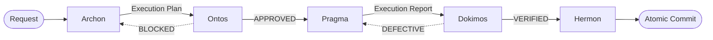

# Topos Pipeline Agentic Framework

The **Topos Pipeline Agentic Framework** is a reference architecture and toolkit for implementing the Topos Integrity Protocol across different AI coding assistants and orchestration engines. 

Instead of allowing an AI agent to execute coding tasks in a single, unstructured pass, this framework enforces a **5-stage sequential pipeline**, ensuring deep reasoning, structural auditing, robust execution, and strict verification before any code is committed.

## The 5-Stage Architecture

Regardless of the underlying LLM or harness, the pipeline always operates through five specialized roles (or distinct agents):

1. **Archon (Strategic Planner)**: Receives the user request, analyzes the repository, and creates a numbered Execution Plan mapping dependencies and risks.
2. **Ontos (Structural Auditor)**: Audits the Archon's plan against the Topos Integrity Protocol (Vertical/Horizontal Tracing, Gap Cascade Prevention). Emits `APPROVED` or `BLOCKED`.
3. **Pragma (Execution Engine)**: Generates the code and modifies files according to the approved plan. Returns an Execution Report.
4. **Dokimos (Verification Engine)**: Validates the execution by running linters, tests, and static analysis. Emits `VERIFIED` or `DEFECTIVE` (routing back to Pragma).
5. **Hermon (Version Control)**: Packages the verified changes into atomic, Semantic Versioning / Conventional Commits.

## Supported Harnesses

This repository provides three distinct implementation harnesses, adapted to the capabilities and paradigms of different AI orchestration tools:

- [**Antigravity (Gemini)**](./gemini/README.md): Native integration for Google Antigravity / Gemini CLI using `/workflows` and sequential subagent role-switching.
- [**Claude Code**](./claude/README.md): A true multi-agent implementation where each phase is executed by a separate agent instance interacting via tool calls.
- [**Codex**](./codex/README.md): A global configuration-based implementation utilizing `AGENTS.md` to force sequential role-switching.

Choose the harness that matches your active AI coding assistant to deploy the Topos pipeline to your environment.
