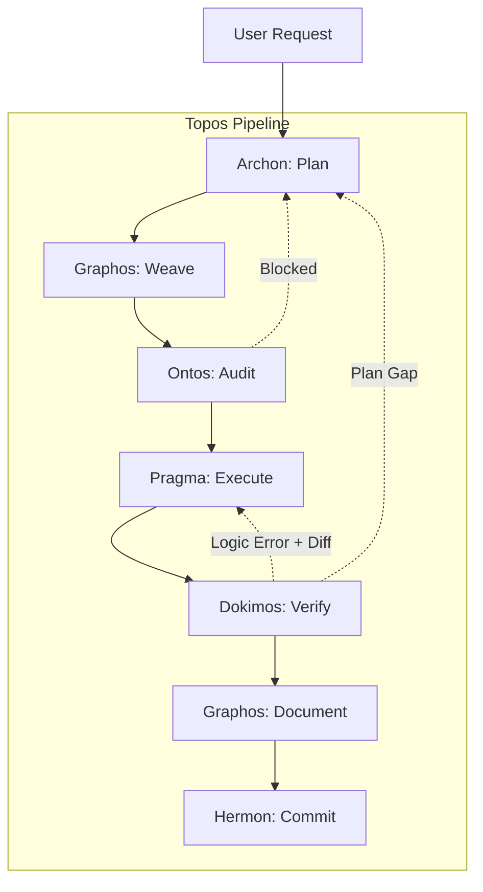

# Topos Pipeline Agentic Framework (V2 Auto-Evolutionary)

The **Topos Pipeline Agentic Framework** is a reference architecture and toolkit for deploying the Topos Integrity Protocol across autonomous AI agents. 

Moving beyond linear scripting, Topos V2 establishes a **True Multi-Agent Concurrent Orchestration System**. It enforces deep reasoning, structural auditing, multi-modal grounding, and strict verification before any code is committed, allowing the AI to act as a *Principal Engineer* rather than a passive assistant.

---

## 🏗️ The 6-Stage Architecture

Regardless of the underlying LLM or harness, the pipeline operates through six specialized, asynchronous agent roles. The Chat Orchestrator (you/the master agent) guides this flow, pausing or intervening dynamically.

1. **Archon (Strategic Planner)**: Analyzes the repository and creates a deterministic Execution Plan. Can split tasks into concurrent *Worktree Tracks*.
2. **Graphos (Knowledge Weaver)**: Generates interwoven documentation (`feature_YYYY.md`). Uses a 5-step rollup to prevent context explosion while preserving a chronological Linked List of truths.
3. **Ontos (Structural Auditor)**: Audits the plan against Vertical/Horizontal Tracing and Gap Cascade Prevention. Rejects plans lacking Runbook syncs.
4. **Pragma (Execution Engine)**: Generates the code. Encapsulates repetitive tasks into `agent_*.sh` runbooks. Ingests failure diffs cleanly.
5. **Dokimos (Verification Engine)**: Validates execution. Features **Error State Isolation** (reverts working tree via Git and passes the clean error diff back to Pragma).
6. **Hermon (Version Control)**: Packages verified changes into atomic, Semantic Versioning commits with traceability footers.

---

## 🧠 Advanced Capabilities (Auto-Evolutionary)

- **Concurrent Feature Execution (Worktree Isolation)**: The Orchestrator can spawn multiple subagents (`Workspace: share/branch`) to develop features in parallel via Git worktrees, merging them later.
- **Epistemic Authority Guardrail**: The human is a strategic navigator, not the absolute truth. Agents are instructed to refute hallucinated APIs, deprecated tools, or non-existent solutions *by any means necessary*.
- **Multimodal Grounding Protocol**: If visual evidence contradicts human text narration, *visual empiricism takes precedence* to prevent hallucination cascades.
- **Runbook Encapsulation**: Any repetitive deployment pattern is automatically extracted into tested `scripts/agent_*.sh` files.

---

## ⚙️ Deployment & Discovery (CLI vs GUI)

The framework utilizes **Progressive Disclosure** and a strict **Workspace > Global** hierarchical discovery model. This ensures both the CLI and the GUI operate under the exact same source of truth.

### Antigravity Integration
Whether you use the **Antigravity CLI (`agy`)** or the **Antigravity 2.0 GUI (IDE)**:
1. **Workspace Priority**: When opening this repository, the engine scans the `.agents/` folder. The native `agent.json` definitions override any global settings, allowing true async multi-agent orchestration directly inside the project.
2. **Global Fallback**: If you open a project without an `.agents/` folder, the engine falls back to the global master contexts deployed at `~/.gemini/GEMINI.md` and `~/.claude/CLAUDE.md`.

*(Note: Legacy slash commands in `/workflows` are deprecated in favor of native `.agents/` subagent invocation).*

---

## 🚀 Supported Harnesses

This repository provides distinct implementation harnesses adapted to different orchestration engines:
- **[Antigravity (Native)](./.agents/)**: True async JSON subagent definitions (`.agents/agent.json`) for seamless GUI/CLI integration.
- **[Claude Code](./claude/README.md)**: Agent instructions leveraging Claude's native multi-agent capabilities.
- **[Codex](./codex/README.md)**: Global configuration-based adapter for Codex environments.
