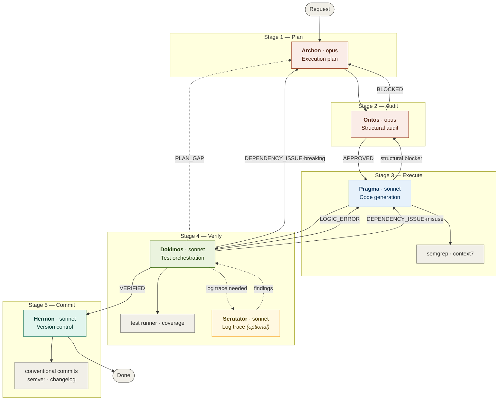
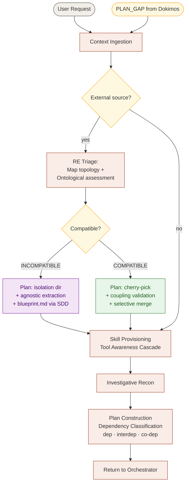
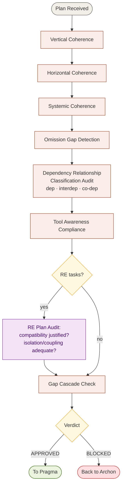
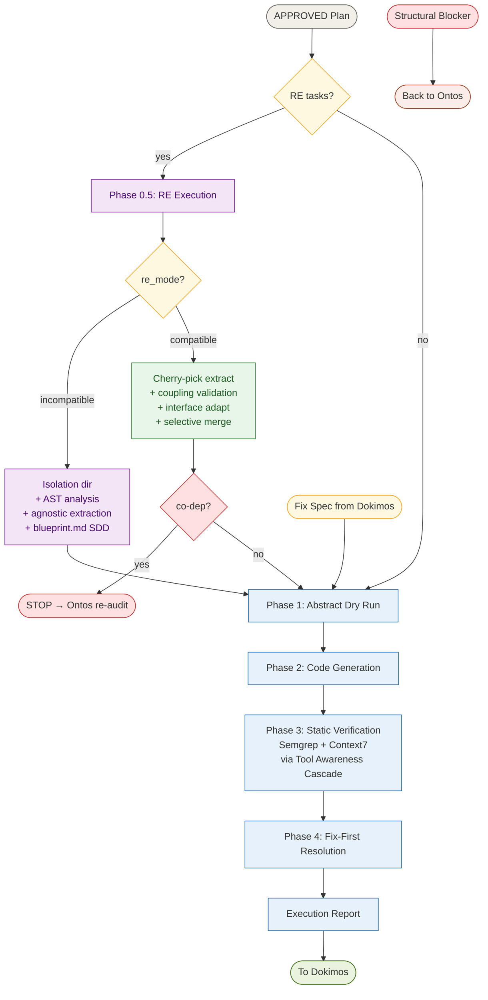
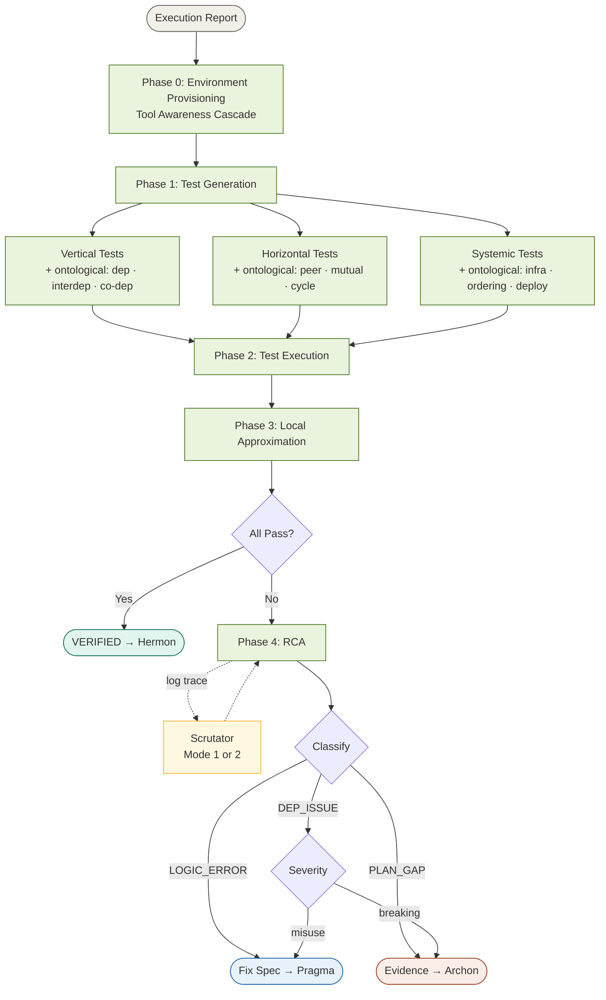
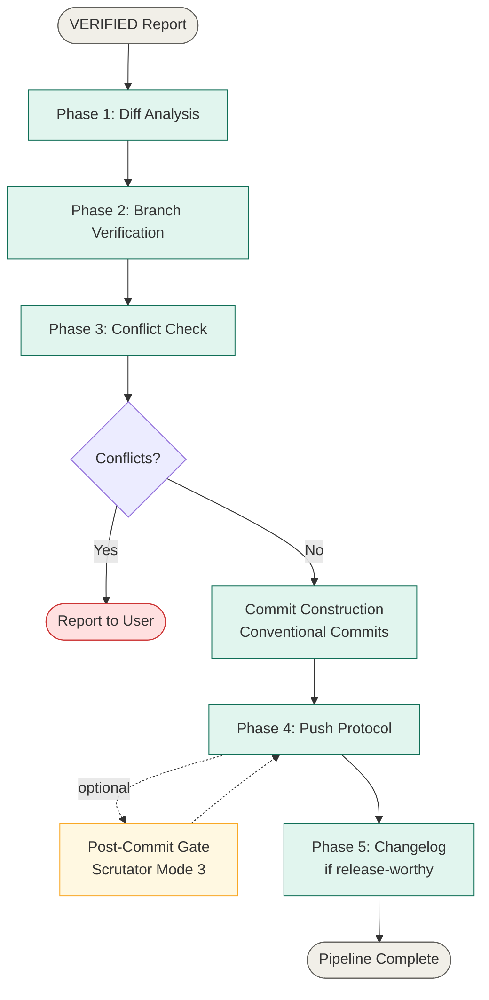
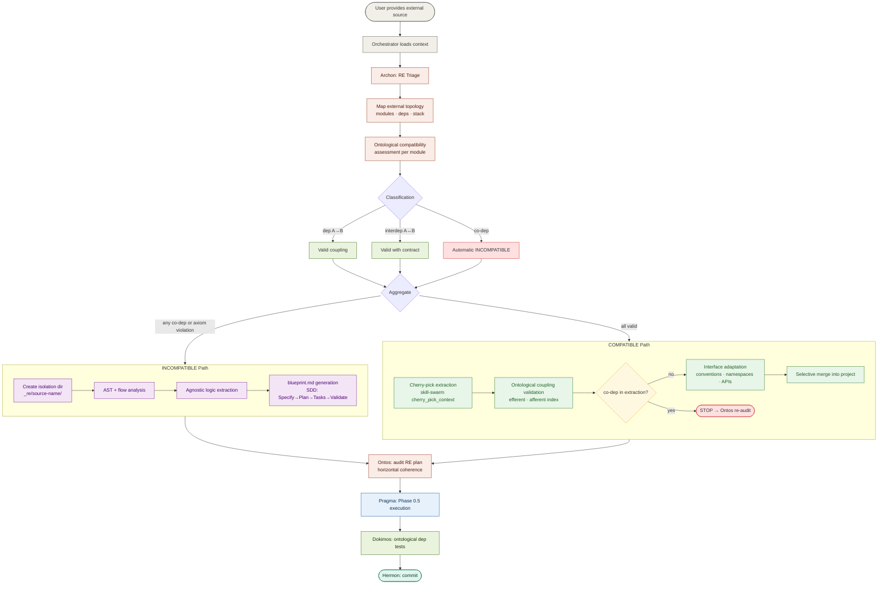

# Topos Integrity Pipeline

A five-stage agentic development pipeline for Claude Code that enforces structural integrity on every change through ontological validation, automated testing, and traceable version control.

## Architecture



## Agents

| Agent | Stage | Model | Purpose |
|-------|-------|-------|---------|
| **Archon** | 1 — Plan | opus | Produces the execution plan. Identifies stack, provisions skills/tools, builds a dependency-aware task list. Never writes code. |
| **Ontos** | 2 — Audit | opus | Validates the plan across four dimensions: vertical coherence (layer integrity), horizontal coherence (peer effects), systemic coherence (ecosystem impact), and omission gap detection. |
| **Pragma** | 3 — Execute | sonnet | Transforms the validated plan into code. Runs abstract dry run, generates code, verifies with Semgrep + Context7, applies fix-first resolution. |
| **Dokimos** | 4 — Verify | sonnet | Provisions test toolchain, generates ontological test suites (vertical/horizontal/systemic), executes them, performs RCA on failures, and routes defects appropriately. |
| **Scrutator** | 4.1 — Log Trace | sonnet | Sub-step of Dokimos. Truncates logs, reads Docker/application output after test execution, parses errors/warnings/anomalies. Fail-open: Dokimos continues without log trace if Scrutator fails. |
| **Hermon** | 5 — Commit | sonnet | Constructs atomic commits following Conventional Commits v1.0.0, GitKraken best practices, and TM Forum traceability. Manages branches, push, and changelog. |

## Agent Interaction Map

Each agent has a defined set of inputs, outputs, and routing targets. The orchestrator (CLAUDE.md) mediates all inter-agent communication — agents never invoke each other directly.

```
┌─────────────────────────────────────────────────────────────────────┐
│                        ORCHESTRATOR (CLAUDE.md)                     │
│                   Routes all inter-agent messages                   │
└─────────┬───────────┬───────────┬───────────┬───────────┬──────────┘
          │           │           │           │           │
          ▼           ▼           ▼           ▼           ▼
    ┌──────────┐┌──────────┐┌──────────┐┌──────────┐┌──────────┐
    │  ARCHON  ││  ONTOS   ││  PRAGMA  ││ DOKIMOS  ││  HERMON  │
    │  Plan    ││  Audit   ││ Execute  ││  Verify  ││  Commit  │
    └──────────┘└──────────┘└──────────┘└──────────┘└──────────┘

Routing table:
  Archon  ──plan──►  Ontos
  Ontos   ──APPROVED──►  Pragma
  Ontos   ──BLOCKED──►  Archon  (remediation items)
  Pragma  ──report──►  Dokimos
  Pragma  ──blocker──►  Ontos  (structural issue)
  Dokimos ──VERIFIED──►  Hermon
  Dokimos ──LOGIC_ERROR──►  Pragma  (fix specification)
  Dokimos ──PLAN_GAP──►  Archon  (full restart)
  Dokimos ──DEP_ISSUE·breaking──►  Archon
  Dokimos ──DEP_ISSUE·misuse──►  Pragma
  Dokimos ─ ─log trace─ ─►  Scrutator  (optional sub-step)
  Scrutator ─ ─findings─ ─►  Dokimos
  Hermon  ──done──►  Orchestrator  (pipeline complete)
  Hermon  ──conflict──►  User  (manual resolution)
```

## Agent Workflow Details

### Archon — Planning Workflow



### Ontos — Audit Workflow



### Pragma — Execution Workflow



### Dokimos — Verification Workflow



### Hermon — Commit Workflow



### Reverse Engineering — Decision Flow



## Ontological Foundation

The pipeline operates under the **Topos Integrity Protocol**: every change is a node in a dependency graph, and a change is valid only if the graph remains coherent after it.

Three tracing dimensions apply at every stage:

- **Vertical trace** — data flow integrity across layers: storage → data access → business logic → API → consumer.
- **Horizontal trace** — peer modules that share imports, exports, state, or events with the changed module.
- **Systemic trace** — CI/CD pipelines, env vars, secrets, config maps, container images, Helm values, K8s manifests.

A critical invariant: **gap cascade prevention**. Fixing gap X1 must not create gap X2. If resolving X2 would reintroduce X1, the fix is structurally invalid and escalates to Archon for replanning.

## Feedback Loops

The pipeline has three feedback loops, each with a max iteration limit of **3 cycles** before escalating to the user:

### Archon ↔ Ontos (plan revision)
When Ontos returns `BLOCKED`, remediation items go back to Archon. Archon revises the plan and resubmits for audit. This loop catches planning omissions before any code is written.

### Pragma ↔ Dokimos (code fix)
When Dokimos returns `DEFECTIVE (LOGIC_ERROR)`, a Fix Specification goes to Pragma. Pragma applies the fix and resubmits for verification. This loop catches implementation bugs without replanning.

### Dokimos → Archon (plan gap escalation)
When Dokimos returns `DEFECTIVE (PLAN_GAP)`, the entire pipeline restarts from Archon. This catches requirements that only surface at test time — the plan itself was incomplete.

## Scrutator: Log Trace Sub-Step

Scrutator has three operational modes (RCA Trace, Plan-Requested Trace, Post-Commit Gate) defined canonically in CLAUDE.md. See the canonical definition there for trigger conditions, decision authority, and fail semantics per mode.

Summary:
- **Mode 1 (RCA Trace):** Dokimos-initiated, fail-open. Default mode for test failure analysis.
- **Mode 2 (Plan-Requested):** Archon-specified, fail-closed for documentation. Targets specific log patterns.
- **Mode 3 (Post-Commit Gate):** Orchestrator-initiated, fail-open. OFF by default. Checks logs after Hermon commits.

## Model Selection Rationale

**Opus** for Archon and Ontos — these are the stages where the cost of error is highest and the reasoning is open-ended. Planning from ambiguous requirements and detecting omissions in a dependency graph require deep multi-dimensional analysis. False negatives at these stages cascade through the entire pipeline.

**Sonnet** for Pragma, Dokimos, Hermon, and Scrutator — these stages operate within well-defined constraints (a validated plan, a known stack, deterministic protocols). The plan provides sufficient scaffolding that Opus-level reasoning adds cost without proportional benefit. Sonnet is faster, cheaper, and equally effective for pattern-driven execution.

## Dokimos: Test Philosophy

Dokimos provisions its own test environment by detecting the project stack and mapping it to the appropriate toolchain. It integrates with Context7 for API validation and Semgrep for static analysis as a second verification layer (Pragma runs them first during code generation).

### Local Approximation Protocol

Not everything can be tested locally. Dokimos classifies conditions into three tiers:

- **Replicable** — pure logic, DB via test containers, HTTP via mocks.
- **Approximation required** — cloud APIs, payment processing, OAuth → mocked with fixtures. Documented with confidence level.
- **Non-replicable** — production data distribution, multi-region latency, real cert chains → flagged with a `PROJECTION` block documenting the production risk.

### Ontological Test Model

Tests follow the same three dimensions as the audit:

- **Vertical tests** — unit (isolated function), integration (cross-layer), contract (API schemas).
- **Horizontal tests** — import/export validation, shared state, event chains.
- **Systemic tests** — env var existence, config coherence, dependency conflicts.

## Hermon: Commit Standards

Hermon enforces three standards simultaneously:

- **Conventional Commits v1.0.0** — structured commit messages with type, scope, description, body, and footers.
- **GitKraken best practices** — branch naming, commit hygiene, merge strategy.
- **TM Forum traceability** — every commit footer includes `Plan-ID`, `Audit-ID`, and `Verified-By` references linking back through the pipeline.

Commits are ordered by dependency layer: infrastructure first, then migrations, then shared modules, then business logic, then tests. At any commit in the sequence, the repository is in a valid state.

## Agent Capability Matrix

| Agent | Model | permissionMode | disallowedTools | maxTurns |
|-------|-------|----------------|-----------------|----------|
| Archon | opus | plan | NotebookEdit | 30 |
| Ontos | opus | plan | NotebookEdit | 25 |
| Pragma | sonnet | acceptEdits | (none) | 50 |
| Dokimos | sonnet | acceptEdits | NotebookEdit | 50 |
| Hermon | sonnet | default | NotebookEdit | 20 |
| Scrutator | sonnet | default | NotebookEdit, Write, Edit | 15 |

## File Structure

```
├── CLAUDE.md      # Orchestrator — invokes and routes between all agents
├── Archon.md      # Stage 1 — strategic planner
├── Ontos.md       # Stage 2 — structural auditor
├── Pragma.md      # Stage 3 — execution engine
├── Dokimos.md     # Stage 4 — verification engine
└── Hermon.md      # Stage 5 — version control engine
```

> **Convention:** Agent prompt files (*.md in this directory except
> README.md) use ASCII art for pipeline diagrams to minimize token
> consumption when loaded as agent context. README.md uses Mermaid
> diagrams for GitHub rendering. CLAUDE.md uses ASCII art
> (it is loaded as orchestrator context).

> **Naming:** Agent files use PascalCase (Archon.md, Ontos.md)
> matching the `name` field in YAML frontmatter. This differs from
> the Gemini variant (lowercase) per CLI conventions. Claude variant
> uses PascalCase as rendered agent identity in the CLI.

## Usage

The orchestrator (CLAUDE.md) handles all routing automatically. To use the pipeline:

1. Describe your task to the Claude Code CLI.
2. The orchestrator invokes Archon to plan.
3. Ontos audits the plan (loops with Archon if blocked).
4. Pragma generates code (with Semgrep + Context7 verification).
5. Dokimos tests the code (with optional Scrutator log tracing). Loops with Pragma on logic errors, escalates to Archon on plan gaps.
6. Hermon commits and pushes on verification success.

For questions, reviews, or discussions that don't modify files, the orchestrator responds directly — no pipeline invocation needed.

## Error Recovery

| Scenario | Action |
|----------|--------|
| Archon cannot resolve ambiguity | Surface to user |
| Ontos BLOCKED after 3 revisions | Escalate to user with findings |
| Pragma hits structural blocker | Return to Ontos |
| Dokimos DEFECTIVE after 3 fix cycles | Escalate to user with RCA |
| Dokimos discovers plan gap | Full restart from Archon |
| Hermon detects merge conflicts | Report to user |
| Scrutator fails or times out | Dokimos continues without log trace (fail-open) |

## License

Internal tooling — adapt to your project's license.
