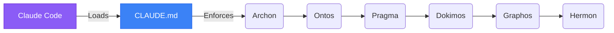

<div align="center">
# Claude Code Harness: Topos Protocol
**Implementing the 6-stage Topos Pipeline in Claude Code**
</div>

## 📌 Implementation
Claude Code relies on global context markdown instructions. This harness utilizes the `CLAUDE.md` master file to dictate the orchestration behavior.




## 🏗️ Agent Formatting (Source of Truth)
In Claude Code, subagents are NOT just standard markdown files. To be recognized as an invocable, routable subagent, the file **MUST** contain a YAML frontmatter block at the very top.

**Format Pattern (`<Agent>.md`):**
```markdown
---
name: <AgentName>
description: <Short description of what the agent does and when to route to it>
model: sonnet  # or sonnet, etc.
permissionMode: autonomous         # or acceptEdits, default
---

# <AgentName> Agent
Role: ...
[Your markdown instructions here...]
```
If an agent lacks this YAML block, it is effectively invisible to the routing table and cannot be spawned as a subagent.

## 🚀 Setup
Deploy the master rules to your global configuration:
```bash
cp claude/CLAUDE.md ~/.claude/CLAUDE.md
```