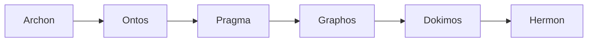

# Topos Integrity Pipeline — Claude Code Edition

This harness implements the [Topos Pipeline Agentic Framework](../README.md) for **Claude Code**. Unlike sequential role-switching models, this implementation uses a **true multi-agent architecture**, leveraging Claude's tool-calling capabilities to spawn and coordinate distinct agent processes.

## Multi-Agent Architecture

Each stage of the Topos pipeline is handled by an isolated Claude agent with its own system prompt, tools, and execution boundaries:

## Agents

- **Archon**: Deployed as the orchestrator and planner. Generates the `Execution Plan`.
- **Ontos**: Acts as a strict gatekeeper. Does not have write access to the codebase. Evaluates dependency topologies and vertical/horizontal traces.
- **Pragma**: The execution engine equipped with code generation and filesystem manipulation tools.
- **Dokimos**: Focused entirely on verification. Equipped with test runners, linters, and `semgrep`.
- **Hermon**: Equipped with Git tools to finalize the pipeline.

## Implementation Details

Because Claude Code supports autonomous inter-agent communication, the transition between stages is dynamic. If `Dokimos` detects an issue, it actively communicates the failure back to `Pragma`, looping until the code passes verification without human intervention.
