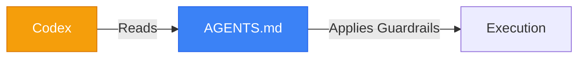

<div align="center">
# Codex Harness: Topos Protocol
**Enforcing Orchestration in Codex**
</div>

## 📌 Implementation
Codex utilizes rule engines and global text policies. We inject the Topos constraints directly into its global space.




## 🏗️ Agent Formatting (Source of Truth)
Unlike Claude Code or Antigravity which support true isolated subagents, **Codex operates as a single orchestrating agent**. It does not spawn separate subagent binaries.

Instead, the orchestration is enforced via **Role Switching**:
1. The global macro rules are placed in `AGENTS.md`.
2. The specific role rules are placed in `~/.codex/agentic-pipeline/roles/<role>.md`.

**Format Pattern (`roles/archon.md`):**
Codex role files are plain Markdown without YAML frontmatter. They must strictly define the "Invariants", "Inputs", and "Outputs" for the role, as the single LLM context window must digest them sequentially to change its own behavior.

## 🚀 Setup
Deploy to the Codex root:
```bash
cp codex/AGENTS.md ~/.codex/AGENTS.md
```