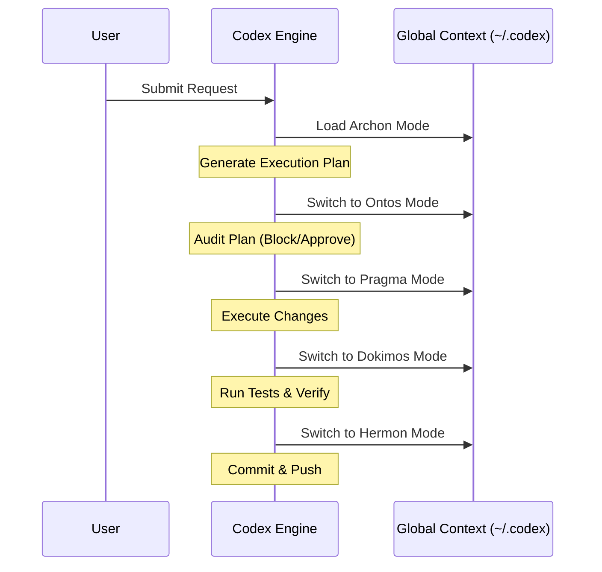

# Topos Integrity Pipeline — Codex Edition

This harness implements the [Topos Pipeline Agentic Framework](../README.md) for **Codex**. Codex uses a global context and instruction model driven by `~/.codex/AGENTS.md`.

## Architecture: Global Sequential Role-Switching

Codex does not spawn separate independent sub-processes for each agent. Instead, it relies on a global adapter that forces the active AI assistant to sequentially load and assume distinct role prompts at each stage of the pipeline:



The role definitions are mirrored to `~/.codex/agentic-pipeline/roles/` and activated by Codex as the pipeline progresses.

## Deployment & Configuration

Run the deployer's global pipeline step after Codex is installed:

```bash
bash /root/deployer/scripts/ubuntu/setup-pipeline.sh
```

**Key Characteristics:**
- **No Project-Local Configuration:** The pipeline enforces integrity at the system level; projects do not need their own `AGENTS.md`.
- **Shared Role Bodies:** The Markdown prompts describing the responsibilities of Archon, Ontos, Pragma, Dokimos, and Hermon are identical to the Gemini implementation, ensuring the Topos Integrity Protocol is strictly followed regardless of the execution medium.
