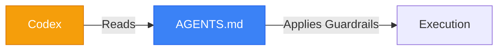

<div align="center">
# Codex Harness: Topos Protocol
**Enforcing Orchestration in Codex**
</div>

## 📌 Implementation
Codex utilizes rule engines and global text policies. We inject the Topos constraints directly into its global space.



## 🚀 Setup
Deploy to the Codex root:
```bash
cp codex/AGENTS.md ~/.codex/AGENTS.md
```