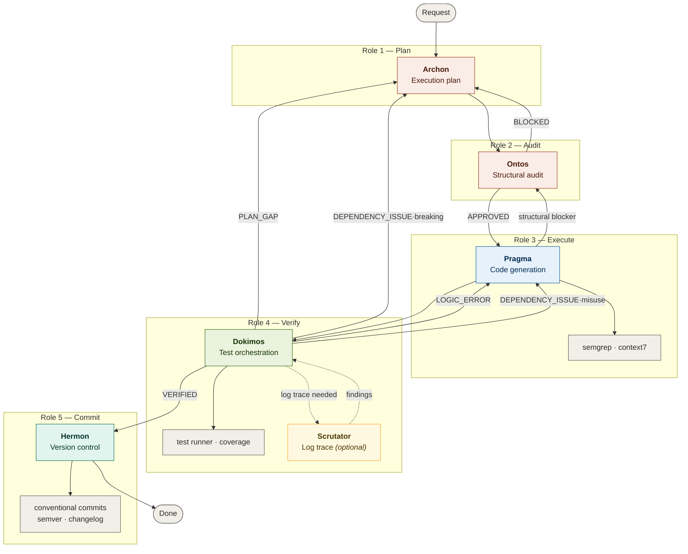

# Topos Integrity Pipeline — Gemini Edition

A five-stage role-switching development pipeline for Gemini CLI and Antigravity that enforces structural integrity on every change through ontological validation, automated testing, and traceable version control.

## How It Differs from Multi-Agent Pipelines

This pipeline does **not** use external agents. A single model assumes roles sequentially, reading each role's context file and operating under its constraints until the phase completes.

| Aspect | Multi-Agent (Claude Code) | Role-Switching (Gemini) |
|--------|--------------------------|------------------------|
| Execution model | Separate processes per agent | Single model, sequential roles |
| Inter-stage communication | Tool calls between agents | Context carried inline |
| Parallelism | Agents can run concurrently | Sequential (CLI) or workflow-triggered (Antigravity) |
| Observation model | Each agent observes prior agent's output | Same model observes its own prior output |
| MCP tools | Per-agent MCP connections | Shared MCP connections via skill-swarm |

The structural protocol (Topos Integrity) is identical across both implementations. The roles enforce the same constraints as the agents — the difference is invocation, not verification.

## Architecture



## Execution Modes

### Gemini CLI

The canonical location for all pipeline files is `~/.gemini/`. The CLI loads `~/.gemini/GEMINI.md` automatically as global context. Role files are read on demand during transitions.

```bash
# Global (canonical — always present)
~/.gemini/
├── GEMINI.md          ← orchestrator (loaded automatically)
├── archon.md          ← role 1
├── ontos.md           ← role 2
├── pragma.md          ← role 3
├── dokimos.md         ← role 4
├── hermon.md          ← role 5
├── settings.json      ← MCP config (skill-swarm, etc.)
└── skills/            ← installed skills (symlinks)

# Project-level (optional override — takes precedence)
your-project/
└── .gemini/
    ├── GEMINI.md      ← project-specific orchestrator
    ├── archon.md      ← project-specific planner
    └── ...            ← only override what you need
```

Resolution order: project `.gemini/*.md` > global `~/.gemini/*.md`.

### Antigravity Workflows

Each role maps to a workflow triggered with `/` in the Antigravity IDE. Workflows are saved prompts that reference the same role files.

```bash
# Global workflows
~/.gemini/antigravity/workflows/
├── plan.md       # /plan → assumes Archon role
├── audit.md      # /audit → assumes Ontos role
├── execute.md    # /execute → assumes Pragma role
├── verify.md     # /verify → assumes Dokimos role
└── commit.md     # /commit → assumes Hermon role

# Project workflows (override global)
your-project/.gemini/workflows/
├── plan.md
├── audit.md
├── execute.md
├── verify.md
└── commit.md
```

See GEMINI.md for the workflow file contents.

## Pipeline Flow Variants

| Flow | Trigger | Roles | Exit |
|------|---------|-------|------|
| **Full** (default) | Code/config/infra changes | Archon → Ontos → Pragma → Dokimos → Hermon | Version Control Report |
| **Audit** | "audit this", "review architecture" | Ontos only | Audit Report |
| **Documentation** | Markdown/README only | Archon → Ontos → Pragma → Hermon | docs commit |
| **Verification** | "test this", "validate" | Dokimos only | Verification Report |
| **Planning** | "plan this", "how would we build X" | Archon → Ontos | Validated plan |

## Roles

| Role | Stage | Purpose |
|------|-------|---------|
| **Archon** | 1 — Plan | Produces the execution plan. Identifies stack, provisions skills via skill-swarm, builds a dependency-aware task list. Never writes code. |
| **Ontos** | 2 — Audit | Validates the plan across five audit dimensions (including dependency classification): vertical coherence, horizontal coherence, systemic coherence, omission gap detection, and dependency relationship classification. |
| **Pragma** | 3 — Execute | Transforms the validated plan into code. Runs dry run, generates code, verifies with Semgrep + Context7, applies fix-first resolution. |
| **Dokimos** | 4 — Verify | Provisions test toolchain, generates ontological test suites with ontological dependency sub-tests (dep · interdep · co-dep), executes them, performs RCA on failures, and routes defects. |
| **Scrutator** | 4.1 — Log Trace | Sub-step of Dokimos. Ephemeral log-tracing behavior within the Dokimos role. Reads logs, parses errors/warnings, returns structured findings. Fail-open. |
| **Hermon** | 5 — Commit | Constructs atomic commits following Conventional Commits v1.0.0, manages branches, pushes. Uses native git (GitKraken MCP as optional enhancement). |

## Skill Provisioning

Both Gemini CLI and Antigravity use **skill-swarm-mcp** for skill management.

Repository: https://github.com/ancrz/skill-swarm-mcp

### Configuration

**Gemini CLI** (`~/.gemini/settings.json`):
```json
{
  "mcpServers": {
    "skill-swarm": {
      "command": "/path/to/skill-swarm-mcp/.venv/bin/python",
      "args": ["-m", "skill_swarm.server"],
      "env": {
        "SKILL_SWARM_GITHUB_TOKEN": "ghp_your_token"
      }
    }
  }
}
```

**Antigravity** (`~/.gemini/antigravity/mcp_config.json`):
```json
{
  "mcpServers": {
    "skill-swarm": {
      "command": "/path/to/skill-swarm-mcp/.venv/bin/python",
      "args": ["-m", "skill_swarm.server"]
    }
  }
}
```

For Antigravity, put the GitHub token in the `.env` file inside the skill-swarm directory (sandboxed environments may not pass `env` blocks).

### Skill Directory

```
~/.agent/skills/                    # Global source (skill-swarm managed)
├── {skill-name}/SKILL.md

~/.gemini/skills/                   # Gemini CLI (symlinks)
├── {skill-name} → ~/.agent/skills/{skill-name}

~/.gemini/antigravity/skills/       # Antigravity (symlinks)
├── {skill-name} → ~/.agent/skills/{skill-name}
```

## Ontological Foundation

The pipeline operates under the **Topos Integrity Protocol**. Three tracing dimensions apply at every stage:

- **Vertical trace** — data flow integrity across layers: storage → data access → business logic → API → consumer.
- **Horizontal trace** — peer modules sharing imports, exports, state, or events.
- **Systemic trace** — CI/CD, env vars, secrets, config maps, container images, Helm values, K8s manifests.

**Gap cascade prevention**: fixing gap X1 must not create gap X2. If resolving X2 reintroduces X1, the fix is structurally invalid — escalates to Archon for replanning.

### Dependency Relationship Classification

- **Dependency** (A → B): one-way, consumer depends on provider.
- **Interdependency** (A ↔ B): mutual contract, both must be in scope.
- **Co-dependency** (A+B inseparable): INVALID. Always requires decomposition. Automatic BLOCKED.

## Feedback Loops

Three feedback loops, each with a max of **3 cycles** before user escalation:

- **Archon ↔ Ontos** — plan revision when Ontos returns BLOCKED.
- **Pragma ↔ Dokimos** — code fix when Dokimos returns LOGIC_ERROR.
- **Dokimos → Archon** — full restart when Dokimos returns PLAN_GAP.

## Scrutator: Log Trace Sub-Step

Scrutator is an ephemeral log-tracing behavior within the Dokimos role (not a separate role file). Three operational modes defined canonically in GEMINI.md:

- **Mode 1 (RCA Trace):** Dokimos-initiated, fail-open. Default for test failure analysis.
- **Mode 2 (Plan-Requested):** Archon-specified, fail-closed for documentation.
- **Mode 3 (Post-Commit Gate):** Post-Hermon, fail-open. OFF by default.

## Reverse Engineering Protocol

When tasks involve external source integration, the pipeline activates RE mode. See GEMINI.md for the canonical definition including:
- RE task markers (`re_source`, `re_mode`)
- Compatibility triage (INCOMPATIBLE: isolation + blueprint.md via SDD / COMPATIBLE: cherry-pick + coupling validation)
- RE Artifact Contracts between roles

## Git Interface

Hermon uses native `git` commands by default. If a GitKraken MCP server is connected, Hermon prefers it for branch visualization and conflict resolution. The commit protocol is the same regardless of interface:

- Conventional Commits v1.0.0.
- Atomic commits (one logical change each).
- TM Forum traceability (Plan-ID, Audit-ID, Verified-By in footers).
- Dependency-ordered commit sequence.
- Never `git add .` — explicit staging only.

## The Observation Problem

This pipeline's single-model architecture raises an interesting structural question from our earlier Schrödinger discussion: the same model that generates code also audits and tests it. There is no external observer.

The Topos Protocol addresses this by making the audit criteria objective properties of the dependency graph rather than subjective judgments. Vertical coherence, horizontal coherence, systemic coherence, and omission gaps are verifiable regardless of who (or what) checks them. The protocol's rigor compensates for the absence of a separate observer.

In practice, the role files create cognitive separation. When the model reads `ontos.md`, it adopts constraints that structurally conflict with Pragma's goals — Ontos is incentivized to find flaws, Pragma to produce code. This tension is the mechanism that approximates the independence of separate agents within a single-model context.

## File Structure

```
~/.gemini/
├── GEMINI.md      # Orchestrator — role switching + workflow generation
├── archon.md      # Role 1 — strategic planner
├── ontos.md       # Role 2 — structural auditor
├── pragma.md      # Role 3 — execution engine
├── dokimos.md     # Role 4 — verification engine
├── hermon.md      # Role 5 — version control engine
├── settings.json  # MCP server config (skill-swarm, etc.)
├── skills/        # Gemini CLI skills (symlinks)
└── antigravity/
    ├── mcp_config.json
    ├── skills/    # Antigravity skills (symlinks)
    └── workflows/
        ├── plan.md    # /plan → Archon role
        ├── audit.md   # /audit → Ontos role
        ├── execute.md # /execute → Pragma role
        ├── verify.md  # /verify → Dokimos role
        └── commit.md  # /commit → Hermon role
```

## Cross-Platform Compatibility

The same Topos Protocol runs on both Claude Code (multi-agent) and Gemini (role-switching). The role files are structurally equivalent to the agent files — same phases, same constraints, same routing. The difference is the invocation model:

| | Claude Code | Gemini CLI | Antigravity |
|---|---|---|---|
| **Orchestrator** | CLAUDE.md | GEMINI.md | GEMINI.md + workflows |
| **Stage files** | Agent .md files | Role .md files | Role .md files |
| **Invocation** | External tool calls | Inline role assumption | `/workflow` triggers |
| **Skill provisioning** | skill-swarm MCP | skill-swarm MCP | skill-swarm MCP |
| **Git interface** | GitKraken MCP → git | GitKraken MCP → git | git |
| **Flow Variants** | 5 variants (CLAUDE.md) | 5 variants (GEMINI.md) | 5 variants (GEMINI.md) |
| **Ontology** | 3-tier dep classification | 3-tier dep classification | 3-tier dep classification |
| **Scrutator** | Ephemeral agent (3 modes) | Ephemeral sub-step (3 modes) | Ephemeral sub-step (3 modes) |
| **RE Protocol** | RE Operational Flow | RE Operational Flow | RE Operational Flow |

## License

Internal tooling — adapt to your project's license.
