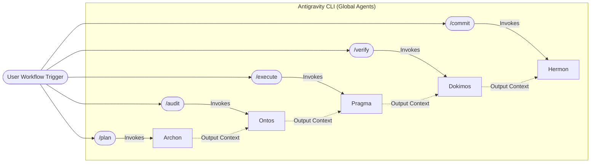

# Topos Integrity Pipeline — Antigravity / Gemini Edition

This harness implements the [Topos Pipeline Agentic Framework](../README.md) for **Google Antigravity** and the **Gemini CLI**.

## Role-Switching via Workflows

Unlike the true multi-agent implementation in Claude Code, the Antigravity implementation maps the 5 Topos roles directly to specialized global agents configured at `~/.gemini/antigravity-cli/agents/{agent_name}/agent.json`. 

The central Orchestrator (Antigravity) delegates to these specialized agents through slash-command workflows:

| Stage | Agent Role | Workflow Trigger | Output |
|-------|------------|------------------|--------|
| 1 | **Archon** | `/plan` | Structured Execution Plan |
| 2 | **Ontos** | `/audit` | `APPROVED` or `BLOCKED` |
| 3 | **Pragma** | `/execute` | Execution Report + Code Changes |
| 4 | **Dokimos** | `/verify` | `VERIFIED` or `DEFECTIVE` |
| 5 | **Hermon** | `/commit` | Atomic Conventional Commits |

## Execution Model

- **Gemini CLI Mode:** The orchestrator invokes each agent sequentially as a sub-process or sub-conversation. Context is passed down the chain.
- **Shared Tools:** All agents share access to MCP connections (e.g., via `skill-swarm`) and local CLI tools.
- **Observation:** The single orchestrating model observes its own prior outputs as it transitions between the roles, ensuring seamless context retention while strictly adhering to the constraints of the current active role (e.g., Ontos cannot write code, only audit).

For details on the structural protocol enforced by these workflows, see the [Main Pipeline Documentation](../README.md).
