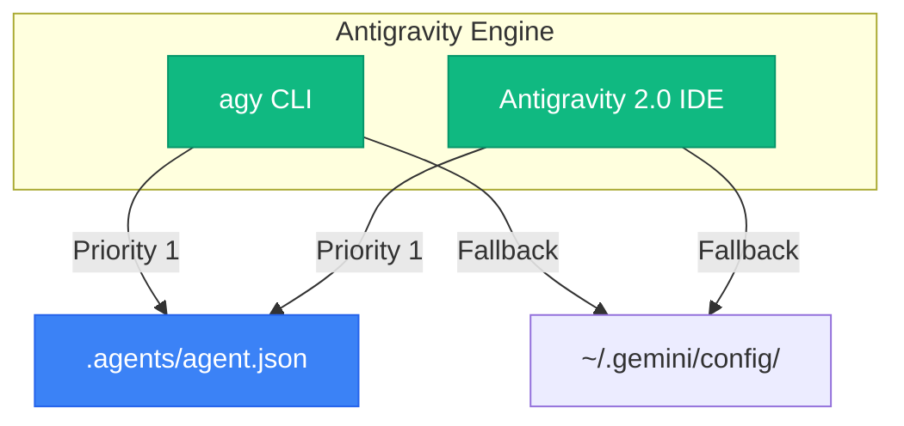

<div align="center">
# Antigravity (Gemini) Harness: Topos Protocol
**True Async Multi-Agent Execution**
</div>

## 📌 Implementation
This harness bridges the gap between legacy CLI Sequential Role-Switching and True Async Orchestration via `.agents/agent.json`.



## 🚀 Setup
The `.agents` folder works natively. To deploy the global fallback:
```bash
cp gemini/gemini-cli/GEMINI.md ~/.gemini/GEMINI.md
```