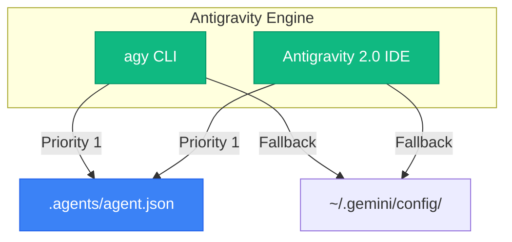

<div align="center">
# Antigravity (Gemini) Harness: Topos Protocol
**True Async Multi-Agent Execution**
</div>

## 📌 Implementation
This harness bridges the gap between legacy CLI Sequential Role-Switching and True Async Orchestration via `.agents/agent.json`.




## 🏗️ Agent Formatting (Source of Truth)
Antigravity supports two discovery mechanisms for agents: `agent.json` or `agent.md`.

**Format A: JSON Structure (`.agents/agents/<name>/agent.json`)**
```json
{
  "name": "graphos",
  "description": "Documentalist agent. Tracks plan revisions.",
  "system_prompt": "Markdown instructions here...",
  "enable_write_tools": true,
  "enable_subagent_tools": false,
  "enable_mcp_tools": true
}
```

**Format B: Markdown with Frontmatter (`~/.gemini/config/agents/<name>/agent.md`)**
```markdown
---
name: graphos
description: Documentalist agent.
enable_write_tools: true
---
# Graphos System Prompt
[Instructions here...]
```
Unlike Claude Code, Antigravity uses Progressive Disclosure: `.agents/` inside the local workspace ALWAYS overrides the global `~/.gemini/config/` definitions.

## 🚀 Setup
The `.agents` folder works natively. To deploy the global fallback:
```bash
cp gemini/gemini-cli/GEMINI.md ~/.gemini/GEMINI.md
```